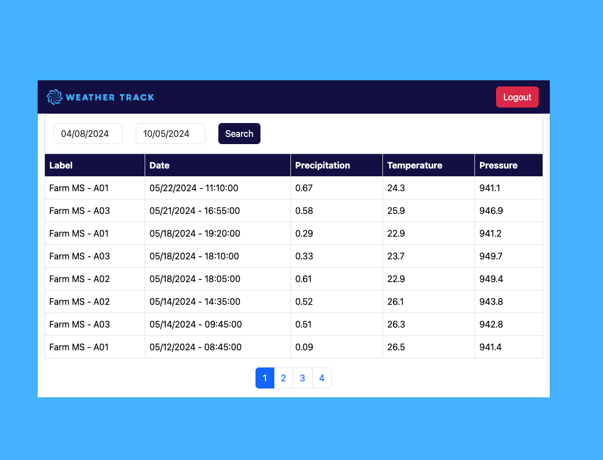
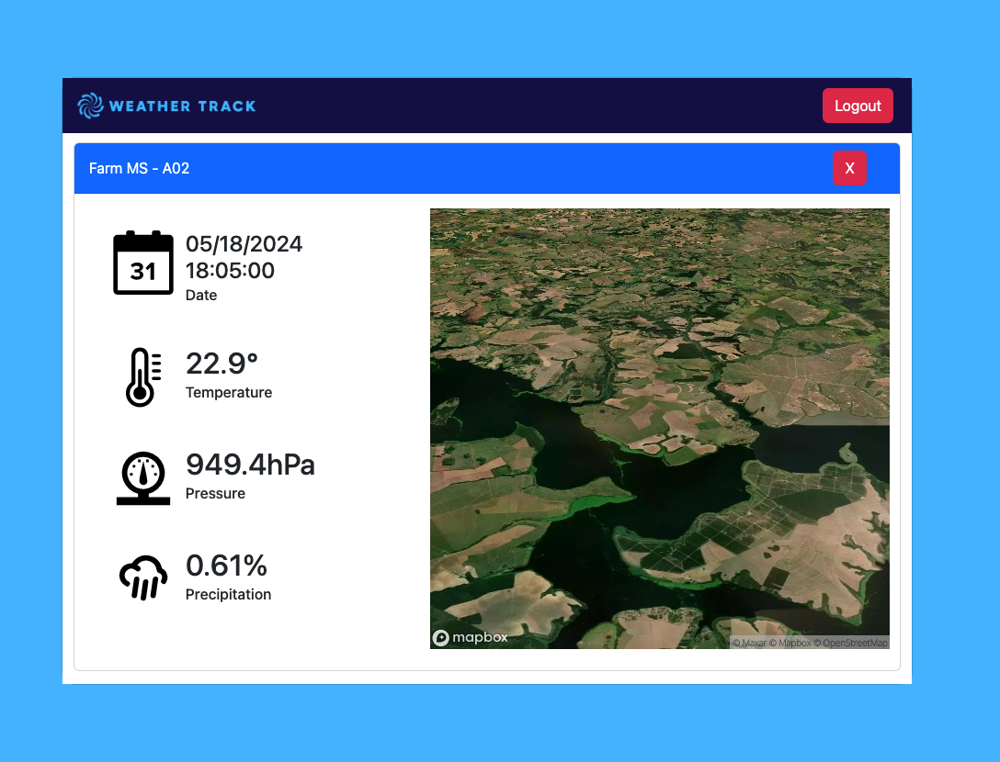
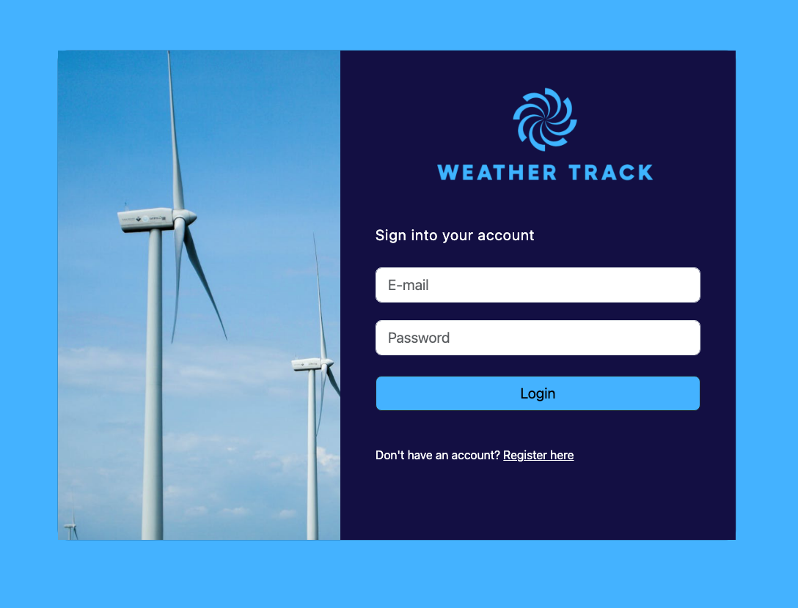
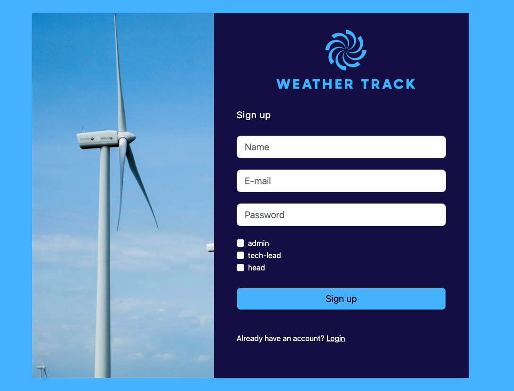

<div align="center">
    
    <p align="center">
        Full-stack project of a data viewer collected from various weather stations. 
    </p>
</div>

## About The Project

<div align="center">
    <table border=0>
        <tr>
            <td></td>
            <td></td>
        </tr>
    </table>
</div>


Full-stack project of a data viewer for information collected from various weather stations. This study project is built using Angular 18 for the front-end, .NET for the back-end, and MySQL and MongoDB as databases.

The goal of the project is to build a data viewer for weather stations. These stations can be installed on farms, ports, airports, or large urban centers. Regardless of the data logger technology, the data should be consolidated into a single interface for the system administrator.

### Built With

<table border=0>
    <tr>
        <td></td>
        <td></td>
        <td></td>
        <td></td>
        <td></td>
        <td></td>
        <td></td>
    </tr>
</table>

## Getting Started

The project is using Docker containers and Docker Compose for orchestration.

### Prerequisites

- Docker >= v20.10.17
- Docker Compose >= v2.6.1

If you want to run the APIs and the front-end project outside of Docker, you will need to:

- .NET SDK 6.0
- Angular CLI 18

Furthermore, the project's functional map uses Mapbox. An API key will be required for the configuration of the `MeasureCard` component.

### Instalation

1. Clone the repo

```sh
git clone git@github.com:Danilo-Oliveira-Silva/weather-track.git
```

2. Run on docker

```sh
docker compose up -d --build
```

3. Access via browser on port `5004` 

    [Weather Track](http://localhost:5004)

## Usage

This project requires authentication, and at this stage of development, only users with elevated access can view the data. You can either register a new account with all permissions or use a pre-registered account. The system comes with a seeder that includes two accounts you can use with the following credentials:

- `Email`: jane@test.com
- `Password`: 123

<div align="center">
    <table border=0>
        <tr>
            <td></td>
            <td></td>
        </tr>
    </table>
</div>

After that, the system will display the meteorological data, which can be queried by date. By clicking on any record, the screen will show detailed data along with a satellite image of the coordinates where the weather station is installed. The image is provided by Mapbox, and you will need to use your own API key to view it.

<div align="center">
    <table border=0>
        <tr>
            <td></td>
            <td></td>
        </tr>
    </table>
</div>


## License

Distributed under the MIT License. See `LICENSE.txt` for more information.

## Contact

Danilo Silva

[](https://www.linkedin.com/in/danilodevs/)
[](https://www.iamdanilo.com/)
[](https://bsky.app/profile/danilodev.bsky.social)
[](mailto:danilo.o.s@hotmail.com)
[](https://dev.to/danilosilva)